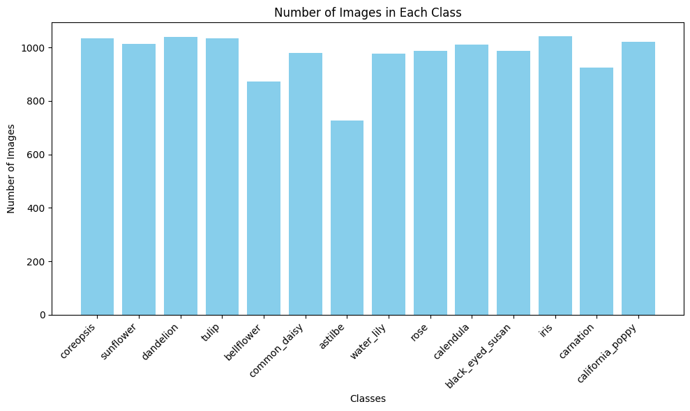
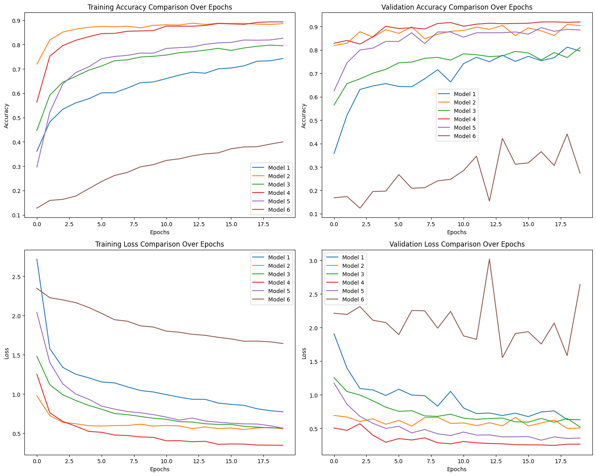

# Flower Classification

## Introduction

10-class flower image classification (black-eyed Susan, calendula, California
poppy, common daisy, coreopsis, dandelion, iris, rose, sunflower, tulip),
evaluated by validation accuracy. Six candidate CNN architectures are trained
independently and compared - a custom Conv2D CNN, the same CNN with
LeakyReLU, and frozen-backbone transfer learning on InceptionV3, InceptionV3
with a LeakyReLU head, VGG16, and ResNet50.

**InceptionV3 + LeakyReLU head (Model 4)** is the best performer: an
InceptionV3 backbone (Szegedy et al., "Rethinking the Inception
Architecture for Computer Vision," CVPR 2016,
https://arxiv.org/abs/1512.00567), frozen and pretrained, feeding four
Conv2D+BatchNorm+LeakyReLU blocks before a dense softmax head.

| Model | Val Accuracy |
|-------|--------------|
| Model 6 (ResNet50) | 27.34% |
| Model 1 (Conv2D CNN) | 79.55% |
| Model 3 (Conv2D + LeakyReLU) | 81.07% |
| Model 5 (VGG16) | 88.54% |
| Model 2 (InceptionV3) | 90.46% |
| **Model 4 (InceptionV3 + LeakyReLU)** | **91.99%** |

*Measured on the historical training runs recorded in `Flower_model.ipynb`
(20 epochs each).*

## Environment Setup

```bash
git clone https://github.com/ArkZ10/Plant-Classification.git
cd Plant-Classification

conda create -n flower-classification python=3.10 -y
conda activate flower-classification

pip install -r requirements.txt
```

## Usage

All scripts are run **from the repository root**.

### 1. Prepare dataset

`Dataset/` already ships with the repo (superset of classes); this splits
the 10 classes actually used into `data_split/train` and `data_split/val`,
and plots the per-class distribution:

```
Dataset/
├── black_eyed_susan/
├── calendula/
├── ... (10+ class folders)
```

```bash
python tools/prepare_dataset.py
```

### 2. Training

Each model trains independently (no warm-starting between them):

```bash
python train/train_model1.py   # Conv2D + MaxPooling CNN
python train/train_model2.py   # InceptionV3 (frozen) + Conv2D head
python train/train_model3.py   # Conv2D CNN + LeakyReLU
python train/train_model4.py   # InceptionV3 (frozen) + LeakyReLU head
python train/train_model5.py   # VGG16 (frozen) + LeakyReLU head
python train/train_model6.py   # ResNet50 (frozen) + LeakyReLU head
```

Models 2 and 4 load `Pre-Trained Model/inception_v3_weights_tf_dim_ordering_tf_kernels_notop.h5`
locally; models 5 and 6 fetch ImageNet weights via Keras Applications.
Each script saves `checkpoints/<name>.keras` and `history/<name>.json`.

### 3. Compare results

```bash
python tools/plot_results.py
```

Loads all six `history/*.json` files and saves the 2x2 accuracy/loss
comparison grid to `figures/model_comparison.png`.

## Performance Snapshot

| Model | Backbone | Key Addition | Val Accuracy |
|-------|----------|---------------|--------------|
| Model 6 | ResNet50 (frozen, ImageNet) | LeakyReLU head | 27.34% |
| Model 1 | none (custom CNN) | Conv2D + MaxPooling, L2 reg | 79.55% |
| Model 3 | none (custom CNN) | + LeakyReLU activations | 81.07% |
| Model 5 | VGG16 (frozen, ImageNet) | LeakyReLU head | 88.54% |
| Model 2 | InceptionV3 (frozen) | Conv2D head | 90.46% |
| **Model 4** | **InceptionV3 (frozen)** | **+ LeakyReLU head** | **91.99%** |

Model 6 (ResNet50) underperforms all other models, including the plain
CNN baseline - likely undertrained relative to its capacity in just 20
epochs with a frozen backbone.

## Deployment

The trained Model 4 was exported to TensorFlow Lite
(`Flower_Classification_optimized.tflite`, conversion not included in this
repo) and is bundled into the Android app under `myApp/`, which loads it
from `myApp/app/src/main/ml/` for on-device inference via the camera or
gallery.

## Project Structure

```
.
├── options.py                  # CLI-configurable paths and hyperparameters
├── net/
│   ├── backbones.py              # frozen InceptionV3/VGG16/ResNet50 loaders
│   └── models.py                 # build_model1..build_model6
├── utils/
│   ├── data_utils.py              # train/val split, ImageDataGenerator setup
│   └── eda_utils.py               # resolution check, class counts/plot
├── train/
│   ├── common.py                  # shared compile/fit/save
│   └── train_model1.py .. train_model6.py
├── tools/
│   ├── prepare_dataset.py         # EDA + train/val split
│   └── plot_results.py            # 2x2 accuracy/loss comparison grid
├── figures/                        # saved plots
├── Dataset/, Test_dataset/         # image data
├── Pre-Trained Model/               # local InceptionV3/ResNet50 weights
├── myApp/                           # Android deployment app
└── Flower_model.ipynb                # original exploratory notebook
```




